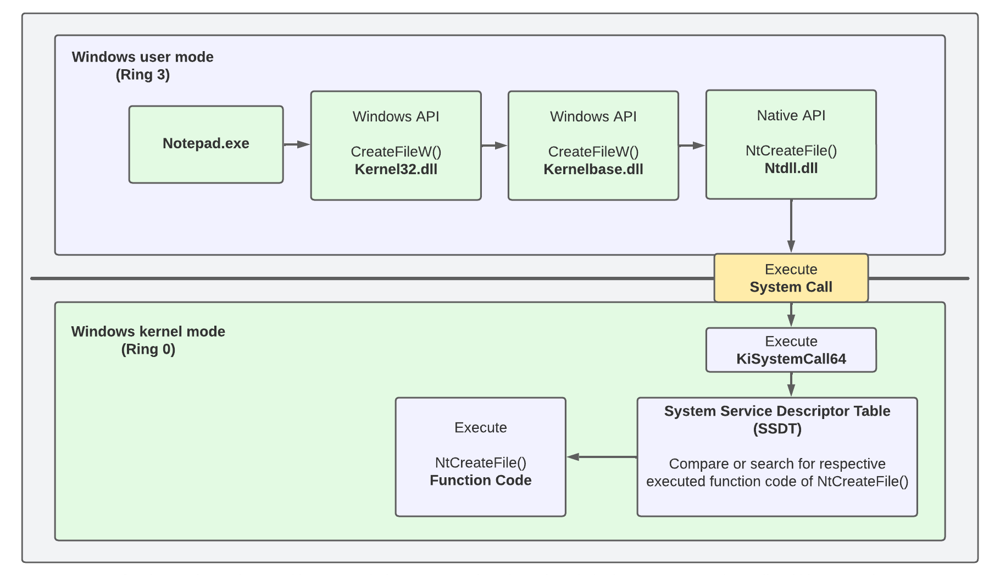
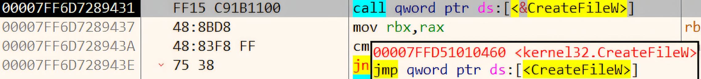
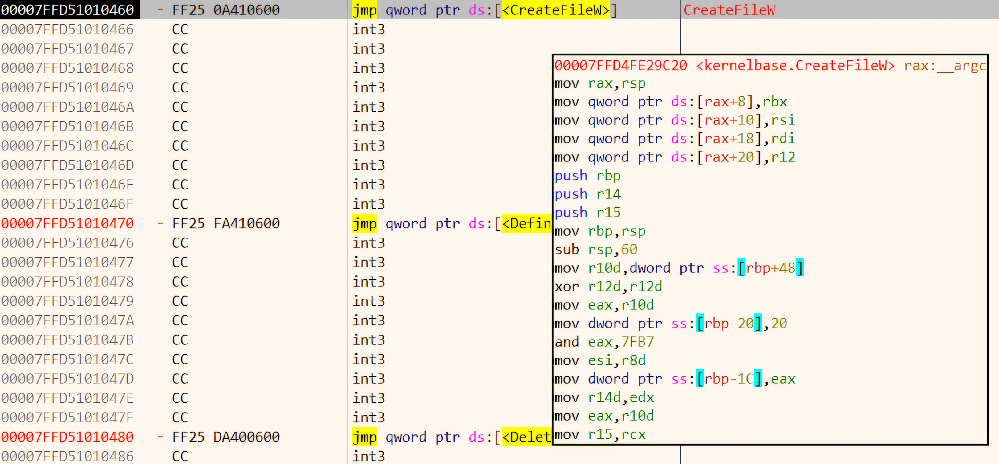
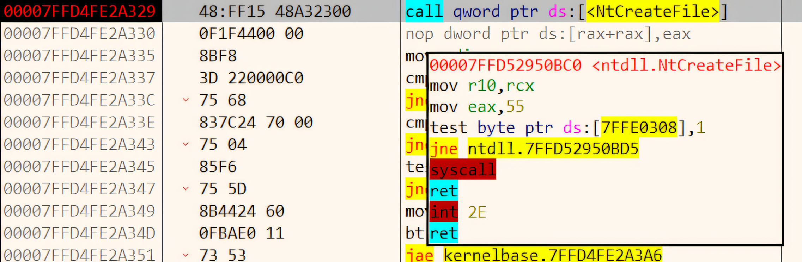
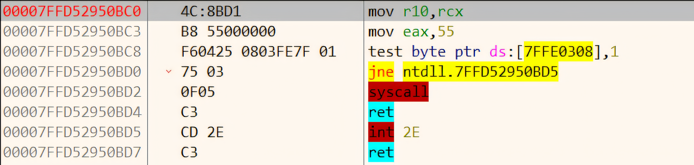
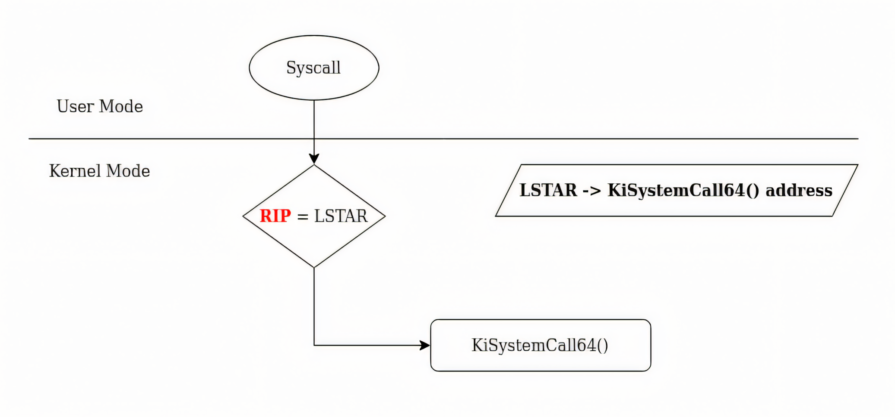

### Windows API

The Windows application interface (API) is the user-mode system programming interface to the Windows OS family as per windows internals definition. Also, prior to the introduction of 64-bit versions of Windows, the programming interface to the 32-bit versions of the Windows OS was called the Win32 API.

Nowadays, it refers to both the 32-bit and 64-bit variants.

Before proceeding to a clear definition, we need to understand what does user and kernel mode means.

- **User Mode:** This is where regular applications (like your browser, text editor, etc.) run. They don’t have direct access to the hardware or core OS resources to ensure stability and security. By chance, if they need to perform actions that require system-level access (e.g., reading from disk), then these applications perform system calls (**syscalls**) via the **Windows API**, which requests the kernel to perform the action on their behalf. 

- **Kernel Mode:** This is where the core of the operating system, including hardware drivers and system-level processes operates. It has full access to system resources.

> It should be clear by now, that user mode programs must "ask" the **kernel** to perform tasks that involve low-level system operations through syscalls.
{: .prompt-info }

_User Mode and Kernel Mode_

#### So, What Actually is Windows API ?

Windows API is a set of tools that allows develops to create programs that can interact with the Windows OS. It works in **user mode**, meaning it lets programs access system resources like files, memory and devices without interacting directly with the core parts of the OS.

Following are some set of tools:

 - **File Management**: Tools to create, read, write, and delete files. For example, the `CreateFile` function allows programs to open or create files.
 - **Memory Management**: Functions like `VirtualAlloc` to allocate memory for a program.
 - **Window Management**: Tools to create and manage windows in a graphical user interface, like `CreateWindowEx` for creating a new window.
 - **Process and Thread Management**: Functions like `CreateProcess` and `CreateThread` to run programs and manage tasks.
 - **Device Input**: Tools to handle input from the keyboard or mouse, like `GetAsyncKeyState` to detect key presses.

Note that Windows API operates in **user mode** doesn't necessarily mean that it doesn't interact with kernel mode. It interacts with the kernel mode when it needs to access core OS services using **syscalls**. Take the following example :-

- Suppose your application calls `ReadFile(hFile, buffer, buffersize, &bytesRead, NULL)` which is a function that operates in **user mode**.

- Now the `ReadFile` function performs initial checks and prepares for the operation. The execution is still in **user mode**.

- The `ReadFile` function makes a **system call** to the kernel to perform the actual file read operation. The `ReadFile` function makes a **system call** to the kernel to perform the actual file read operation.

- The kernel performs the file read operation, accessing hardware or system resources as needed. The operation is performed in **kernel mode**.

- The kernel completes the file read and returns the result to the `ReadFile` function. Execution switches back to **user mode**.

- The `ReadFile` function returns the result (e.g., number of bytes read) to the calling application. The result is available in **user mode**.

> Please note that, it is just a general overview of how the process looks like. Currently we do not have enough tools to understand all the workings behind the scene.
{: .prompt-info }

### Some General Concepts

#### Windows Runtime

Windows 8 introduced a new API and supporting runtime called the Windows Runtime ( WinRT ) for building modern, touch-friendly and visually appealing apps using multiple programming languages like C++, C#, VB.NET and JavaScript. It is not to be confused with Windows RT **which was for the discontinued ARM-based Windows OS version**.

#### .NET framework

The **.NET Framework** is a software development platform created by Microsoft that provides a runtime environment and libraries for building and running applications. It supports multiple programming languages like C#, VB.NET, and F#.

It allows developers to create desktop applications, web apps, and services, and it runs primarily on Windows operating systems.

The .NET Framework consists of two major components:

- **The Common Language Runtime (CLR)**: This is the run-time engine for .NET and includes a **Just In Time** (JIT) compiler that translates Common Intermediate Language (CIL) instructions to the underlying hardware CPU machine language, a garbage collector, type verification, code access security, and more.

- **The .NET Framework Class Library (FCL)**: This is a large collection of types that implement functionality typically needed by client and server applications, such as user interface services, networking, database access, and much more.

### Services, functions, and routines

The word *service* can refer to a callable routine (specifically a function or procedure that can be invoked during a program's execution) in the OS, a device driver, or a server process. The following list describes what certain terms mean:

- **Windows API Functions:** These are documented, callable subroutines (Typically refers to a smaller, more focused routine, often part of a larger program or routine) in the Windows API. Examples include **CreateProcess**, **CreateFile** and **GetMessage**.

- **Native system services (or system calls):** These are the undocumented, underlying services in the OS that are callable from user mode. For example, **NtCreateFile** is the internal system service the Windows **CreateFileW** function calls to open or create a file.

    
    _How the native system calls work_

    This is how it works:

    1) Our application (e.g., **Notepad.exe**) accesses `kernel32.dll` (this DLL is used for interacting with other processes, memory, drives or the file system) and calls the Windows API **`CreateFileW`** function, which is part of the Windows API. This function is used to open or create a file.

    
    _x64dbg: In main module, calling CreateFileW() whose stub resides in kernel32.dll_

    Here, you can clearly see that there's a `call` instruction which essentially is similar to calling a function, here it is calling `CreateFileW` which resides in kernel32.dll (the '.' after the kernel32 means that we are particularly targeting the `CreateFileW` function under kernel32.dll).

    
    _x64dbg: Entered into kernel32.dll memory space where we see a jump to CreateFileW user-mode implementation which resides in the kernelbase.dll_

    After following the previous `call`, we enter into **kernel32.dll** memory space (the space it takes in a process to load itself). Here we see a small stub or forwarder code containing the `jmp` to the actual user-mode implementation. 
    
    The `jmp` instruction is similar to a `call`. The only difference is that, when you follow a `call` instruction, it pushes the **return address** onto the stack, allowing a return to the instruction immediately after the `call` (e.g., as shown in the previous image with `mov rbx, rax`). In contrast, a `jmp` instruction transfers control without saving the return address, so execution continues from the jump destination without returning to the original spot.

    2) The actual user-mode implementation of `CreateFileW` resides in `kernelbase.dll` (in modern version of Windows). This DLL contains the user-mode implementation of various Windows API functions. The `kernelbase.dll` handles some parameter validation and preparation for the system call but does not directly interact with the kernel.

    
    _x64dbg: Entered into kernelbase.dll where the call to NtCreateFile resides_

    3) `CreateFileW` in `kernelbase.dll` then calls a native API (function) in `ntdll.dll` (the Windows NT Layer DLL), which provides a access to lower-level system services. Specifically, it calls `NTCreateFile` which is the native API for file operation in Windows.

    
    _x64dbg: The NtCreateFile stub which performs a syscall_

    4) The Native API `NTCreateFile` contains the technical instructions or syscall call stub to initiate the system call by executing the system call and enables the temporary transition (CPU switch) from user mode (ring 3) to kernel mode (ring 0) after execution.

    > The `syscall` instruction is a CPU instruction that switches the CPU from user mode (Ring 3) to kernel mode (Ring 0). This is managed using the `SYSCALL/SYSRET` model.
    > 
    > The CPU uses:
    > - `MSRs` (Model-Specific Registers) like `MSR_LSTAR` to know the address of the `KiSystemCall64` handler, which is the system's **kernel-mode system call dispatcher**.
    > - The `GS` segment is switched to point to kernel-mode memory structures such as the `KTHREAD` (which represents the kernel thread for the process).
    > 
    > The CPU saves the current user mode context (e.g., register values, instruction pointer) before the switch, and the kernel stack is activated for the thread.
    {: .prompt-info }

    This is how it looks like
    
    _How transitioning using syscall looks like_

    5) Once in kernel mode, the system service dispatcher `KiSystemCall/KiSystemCall64` consults the **System Service Descriptor Table (SSDT)** which contains the addresses (or pointers) to the actual kernel functions that should be executed based on the executed system call ID (index number in the `EAX` register, here `55`, which is the system call id for `NtCreateFile`). This table maps the system call number for `NtCreateFile` to its corresponding function in the kernel.

    7) Based on the system call number, the **SSDT** directs the call to the appropriate kernel service, which in this case is the kernel implementation of `NtCreateFile`. The kernel's file system drivers (e.g., NTFS drivers) then perform the actual file operation, such as opening or creating the file.

    8) The kernel's file system drivers (such as the NTFS driver) perform the actual operation of opening or creating the file. They access the file system and hardware, which user-mode code can't directly interact with.

    9) Once the file operation is completed by the kernel, the `KiSystemCall64` dispatcher uses the `sysret` instruction to switch the CPU's privilege level back from **Ring 0 (kernel mode)** to **Ring 3 (user mode)**, restoring the user-mode thread's context. The result (e.g., a file handle or error code) is passed back up the chain: from the kernel to **`ntdll.dll`**, then back to **`kernelbase.dll`**, and finally to your application (e.g., Notepad.exe). Control switches back to **user mode** as the result is returned.

    > Yes, there's more to it, but this is sufficient for us now.
    {: .prompt-info}

- **Kernel support functions (or routines):** These are the subroutines inside the Windows OS that can be called only from kernel mode. For example, **ExAllocatePoolWithTag** is the routine that device drivers call to allocate memory from the Windows system heaps (called pools).

- **Windows services:** These are processes started by the Windows service control manager. For example, the **Task Scheduler service** runs in a user-mode process that supports the **schtasks** command (which is similar to the UNIX commands at and cron).

- **Dynamic link libraries (DLLs):** These are callable subroutines linked together as a binary file that can be dynamically loaded by applications that use the subroutines. Examples include msvcrt.dll (the C run-time library) and kernel32.dll (the one we have already seen). Windows user-mode components and applications use DLLs extensively. The advantage DLLs provide over static libraries is that applications can share DLLs, and Windows ensures that there is only one in - memory copy of a DLL’s code among the applications that are referencing it.

 
See you in next part <3❤️